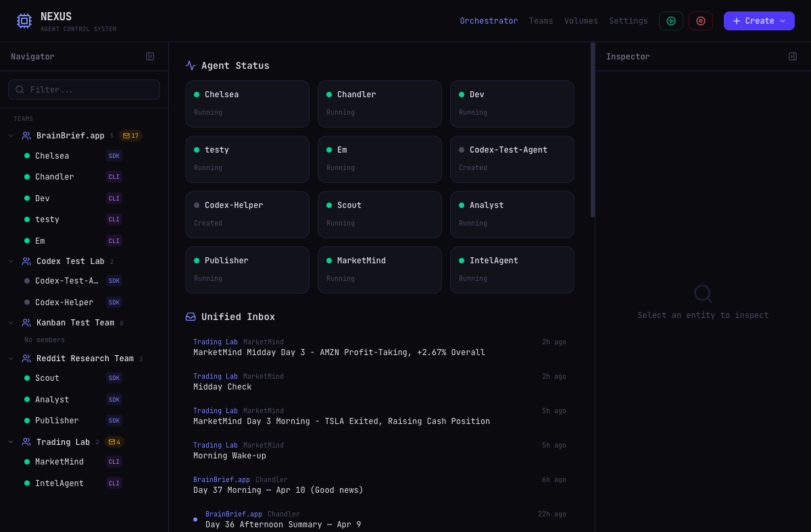

# NEXUS

Agent Control System for orchestrating autonomous AI agents.



## What is NEXUS?

NEXUS is a self-hosted platform for creating, managing, and orchestrating AI agents. Everything runs through a single **unified orchestrator** view:

- **Unified Orchestrator**: One workspace — a left navigator (agents + teams), center workspace tabs, and a right inspector. Create, start, stop, and monitor agents and teams without leaving the view (there are no separate agent/team pages).
- **Cmd+K Command Palette**: Fuzzy-search jump to any agent, team, or page with arrow-key navigation.
- **Workspace Tabs**: Open agents and teams as tabs. Agent tabs expose **Chat / Workspace / History** sub-tabs; team tabs expose **Mailbox / Members / Kanban / Shared / Logs / Timeline**.
- **Inspector Pin**: A pinnable side panel (persisted across selection changes) for quick actions; agent **Settings** and **Cron** open as full-screen modals.
- **Unified Inbox**: Centralized team mailbox with unread badges
- **Kanban Boards**: Visual task management for teams
- **Multiple Cell Types**: Support for Claude Code CLI, SDK-based agents, and more
- **Credential Management**: Secure storage for API keys and OAuth tokens

## Architecture

```
┌─────────────────────────────────────────────────────────┐
│                    NEXUS Dashboard                       │
│                 (React + TypeScript)                     │
└─────────────────────┬───────────────────────────────────┘
                      │ HTTP/WebSocket
┌─────────────────────▼───────────────────────────────────┐
│                     NEXUS API                            │
│                 (Node.js + Express)                      │
├─────────────────────────────────────────────────────────┤
│  Agents  │  Teams  │  Mailbox  │  Credentials  │ Boards │
└─────────────────────┬───────────────────────────────────┘
                      │ Docker API
┌─────────────────────▼───────────────────────────────────┐
│                  Agent Containers                        │
│         (Docker cells running Claude Code, etc.)         │
└─────────────────────────────────────────────────────────┘
```

## Quickstart

### Prerequisites

- Node.js 18+
- Docker Desktop (for containerized agents)
- Anthropic API key (or OAuth credentials for Claude Code)

### 1. Clone and Install

```bash
git clone https://github.com/R-A-V-E-N-delegate/nexus.git
cd nexus

# Install API dependencies
cd api && npm install && cd ..

# Install Dashboard dependencies
cd dashboard && npm install && cd ..
```

### 2. Configure Environment

```bash
# Copy example env
cp .env.example .env

# Edit .env if needed (defaults work for local development)
```

For remote access (e.g., over Tailscale), create `dashboard/.env`:
```bash
VITE_API_URL=http://<your-server-ip>:3001
```

### 3. Build and Start

```bash
# Build the API
cd api && npm run build && cd ..

# Start the API (background)
cd api && npm start &

# Start the Dashboard (development mode)
cd dashboard && npm run dev -- --host 0.0.0.0
```

The dashboard will be available at `http://localhost:5173` (or your configured port).

### 4. Create Your First Agent

1. Open the dashboard — it lands on the **Orchestrator**: a left navigator, center workspace tabs, and a right inspector. Press **Cmd+K** anytime to jump to an agent, team, or page.
2. Click **+ Create → New Agent**.
3. Choose a cell type:
   - **CLI**: Full Claude Code capabilities (requires OAuth)
   - **SDK**: API-based agents (requires API key)
4. The agent opens as a workspace tab with **Chat / Workspace / History** sub-tabs. Its identity and memory live in the **ledger** — a per-agent Docker volume mounted at `/ledger` (`identity.md`, `memory/`, `skills/`) that's read into the system prompt on every run. Edit it from the inspector's **Settings**.
5. Click **Start** (from the navigator or inspector) to launch the cell.

## Directory Structure

```
nexus/
├── api/                 # Backend API server
│   ├── src/
│   │   ├── routes/      # REST endpoints
│   │   └── services/    # Business logic
│   └── data/            # Runtime data (gitignored)
├── dashboard/           # React frontend
│   └── src/
│       ├── components/
│       │   └── orchestrator/  # Navigator, workspace tabs, inspector, Cmd+K palette
│       └── api/         # API client
├── cell/                # Agent container engine
├── templates/           # Agent templates
└── docs/                # Documentation
```

## Cell Types

| Type | Description | Auth Required |
|------|-------------|---------------|
| `cli` | Full Claude Code CLI in container | OAuth |
| `sdk` | Anthropic SDK-based agent | API Key |
| `gemini` | Gemini CLI runner | Gemini API Key |

## Security Notes

- Credentials are stored in `api/data/credentials.json` (gitignored)
- The `.env` file is gitignored
- No sensitive data is committed to the repository
- OAuth tokens are synced from macOS Keychain when available

## License

MIT
